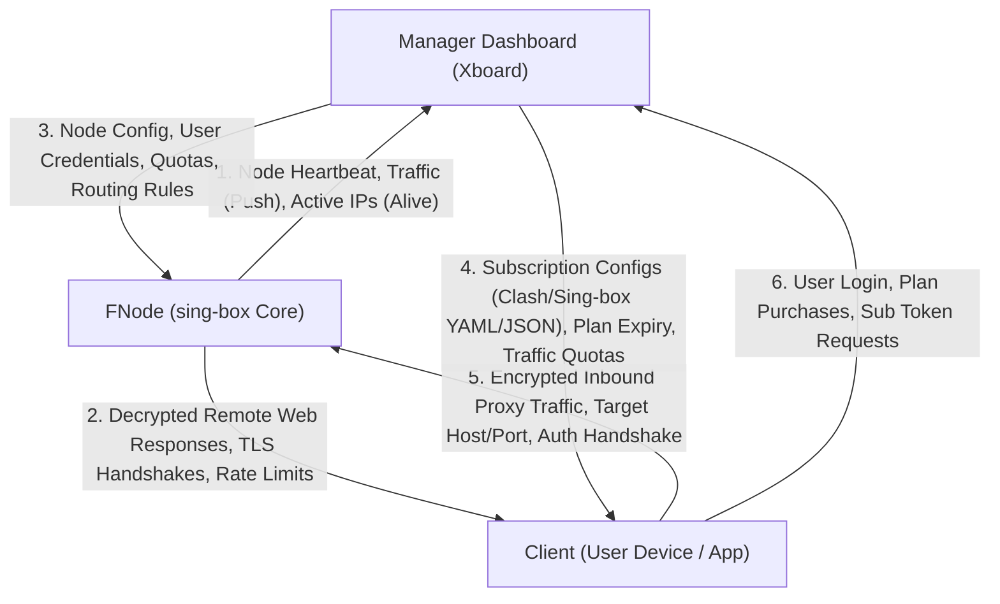
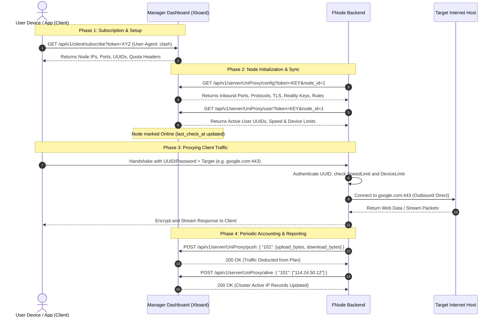

# System Communication & Information Flow Logic

This document details the complete end-to-end information flow between the three core entities in the proxy ecosystem:
1. **FNode** (Backend Proxy Node Server)
2. **Manager Dashboard** (Xboard Centralized Web Panel & Database)
3. **Client** (End-User Device & Proxy Application, e.g., Clash, Sing-box, Shadowrocket, v2rayN)

---

## High-Level Architecture Overview

---

## 1. FNode to Manager Dashboard (Xboard)

FNode acts as an HTTP client communicating with Xboard via the **UniProxy REST API** (`/api/v1/server/UniProxy/*`).

| Item / Action | Endpoint & Method | Transmitted Information & Format | Purpose in Dashboard |
| :--- | :--- | :--- | :--- |
| **Node Heartbeat & Polling** | `GET /api/v1/server/UniProxy/user` `GET /api/v1/server/UniProxy/config` | Query Parameters: `token=<key>&node_id=<id>&node_type=<type>` Header: `If-None-Match: "<ETag>"` | Tells Xboard that FNode is alive. Triggers `ServerService::touchNode()`, updating `last_check_at` so the node displays as **Online (Green)** in admin UI. |
| **User Traffic Consumption** | `POST /api/v1/server/UniProxy/push` | JSON Body: `{ "<UID>": [ <upload_bytes>, <download_bytes> ] }` Example: `{ "101": [1048576, 52428800] }` | Deducts consumed bandwidth from the user's plan quota (`u` and `d`), increments node traffic volume counters, and logs traffic history. |
| **Online Client IP Addresses** | `POST /api/v1/server/UniProxy/alive` | JSON Body: `{ "<UID>": [ "<client_ip_1>", "<client_ip_2>" ] }` Example: `{ "101": ["114.24.50.12", "223.104.134.79"] }` | Only reports clients whose traffic exceeds `DeviceOnlineMinTraffic` (200 KB). Stored in Redis (`USER_ALIVE_DEVICES_<uid>`) to enforce cross-node concurrent `device_limit`. |
| **System Resource Metrics** *(Optional)* | `POST /api/v1/server/UniProxy/status` | JSON Body: `{ "cpu": 12.5, "mem": { "total": 2147483648, "used": 536870912 }, ... }` | Reports CPU load, RAM usage, swap, and disk stats to show node hardware status gauges on Xboard admin panel. |

---

## 2. FNode to Client

FNode handles low-level proxy transport connections directly with the user's client device:

| Action / Stream | Protocol / Channel | Information Transmitted to Client |
| :--- | :--- | :--- |
| **Cryptographic Handshake Response** | TLS / Reality / QUIC / Shadowsocks | - **TLS Certificate** (Let's Encrypt / Caddy cert / Self-signed) or Reality Server Hello. - Protocol-specific response (Shadowsocks AEAD sub-session confirmations, VMess header responses, Hysteria 2 / TUIC connection acceptances). |
| **Proxied Internet Traffic** | Inbound connection stream | Streams back decrypted, unwrapped response payloads from requested internet services (HTML websites, video streams, API responses, game UDP packets). |
| **Bandwidth Rate Limiting** | TCP Window / Token Bucket | FNode's built-in `limiter` throttles transmission speeds to conform with the user's assigned `speed_limit` (Mbps) or dynamic throttles. |
| **Instant Rejection / Block Responses** | TCP RST / ICMP / Fin | - Instant connection termination if user is disabled or exceeded device limit. - Immediate reject on outbound IPv6 destinations with `DisableIPv6: true` (enabled by default across core and node configurations), preventing client 10-second dial timeouts, eliminating `exchange6` DNS socket errors, and triggering instant IPv4 fallback. |

---

## 3. Manager Dashboard (Xboard) to FNode

Xboard responds to FNode's UniProxy polling requests with centralized node parameters and user states:

| Response Endpoint | Information Sent from Dashboard to FNode | How FNode Uses It |
| :--- | :--- | :--- |
| `GET /config` | - **Listen & Port**: `server_port`, `listen_ip`. - **Transport Settings**: WebSocket path, gRPC service name, HTTPUpgrade path, HTTP request headers. - **Security Settings**: Standard TLS parameters or Reality configurations (`server_name`, `dest`, `server_port`, `short_id`, `private_key`). - **Bandwidth & Obfs**: `up_mbps`, `down_mbps`, `obfs`, `obfs-password`, `salamander`. - **Base Intervals**: `pull_interval` (user poll frequency), `push_interval` (traffic report frequency). - **Auditing & Route Rules**: Blocking rules for BT/torrents, spam, government sites, or anti-SSRF CIDRs. | FNode dynamically invokes `core.AddNode(tag, node, options)` to create or update the sing-box inbound (binding SNI to `tls.server_name` and camouflage destination to `handshake.server`) and router rules in memory without restarting the process. |
| `GET /user` | - Array of active users: `[{ "id": 101, "uuid": "...", "speed_limit": 100, "device_limit": 3 }]` - Encoded via MsgPack (fast binary) or JSON streaming. | FNode parses the list, dynamically updates active users via `core.AddUsers()` / `core.DelUsers()`, and configures the local speed and device limiters. |
| `GET /alivelist` | Map of active IP counts per user across all servers in the cluster: `{ "alive": { "101": 2, "102": 1 } }` | FNode checks if a user has already hit their global `device_limit` on other nodes before allowing a new IP to establish a connection. |

---

## 4. Manager Dashboard (Xboard) to Client

Xboard provides the client with configuration and subscription profiles:

| Channel / Interface | Information Sent to Client |
| :--- | :--- |
| **Subscription Delivery** (`/api/v1/client/subscribe?token=...`) | Formats node lists into client-compatible configuration formats (Clash YAML, Sing-box JSON, Surge, Shadowrocket, V2Ray links). Contains: node domain/IP, port, UUID, password, transport path, TLS SNI, Reality public keys. |
| **Quota & Account Headers** | HTTP headers sent during subscription fetch: `Subscription-Userinfo: upload=1048576; download=52428800; total=107374182400; expire=1780000000` Informs client apps of used bandwidth, total plan allowance, and account expiration timestamp. |
| **Web Portal UI** | Web interfaces for registering accounts, buying plans, submitting support tickets, and viewing service announcements. |

---

## 5. Client to FNode

The client device initiates proxy connections through FNode:

| Stage | Data Transmitted to FNode |
| :--- | :--- |
| **1. Protocol Handshake** | Client connects to FNode listening port and sends cryptographic handshake proving identity: - **Shadowsocks**: Key-derived AEAD sub-keys. - **VMess / VLESS**: User UUID and authentication hash. - **Trojan**: SHA-224 password hash. - **Hysteria 2 / TUIC**: User UUID/password with optional Salamander obfuscation. |
| **2. Target Destination Request** | Encapsulated destination address (Domain name or IPv4/IPv6 IP + target port, e.g. `google.com:443`). |
| **3. Upstream Data Stream** | Raw application data sent by user applications (HTTP requests, TLS Client Hello, DNS queries, uploaded files). |

---

## 6. Client to Manager Dashboard (Xboard)

Clients interact directly with Xboard for management and subscription lifecycle:

| Action | Information Sent to Dashboard |
| :--- | :--- |
| **Subscription Fetch** | HTTP `GET /api/v1/client/subscribe?token=<user_sub_token>` with client `User-Agent` (e.g. `ClashMeta`, `sing-box`, `Shadowrocket`) so Xboard can return the correct syntax. |
| **Authentication & Login** | User email, hashed password, 2FA TOTP code, or Telegram OAuth login tokens. |
| **Plan Purchases & Orders** | Plan selection, billing cycle, discount coupons, and payment gateway interactions (Alipay, WeChat, Stripe, USDT/Cryptomus). |
| **Support Inquiries** | Customer service support tickets, bug reports, and account cancellation requests. |

---

## Full End-to-End Sequence Diagram

